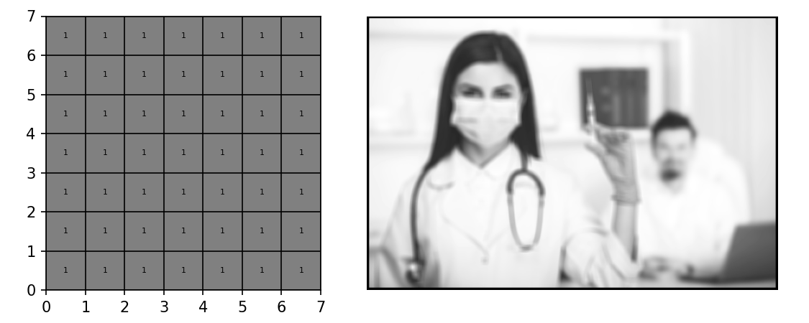
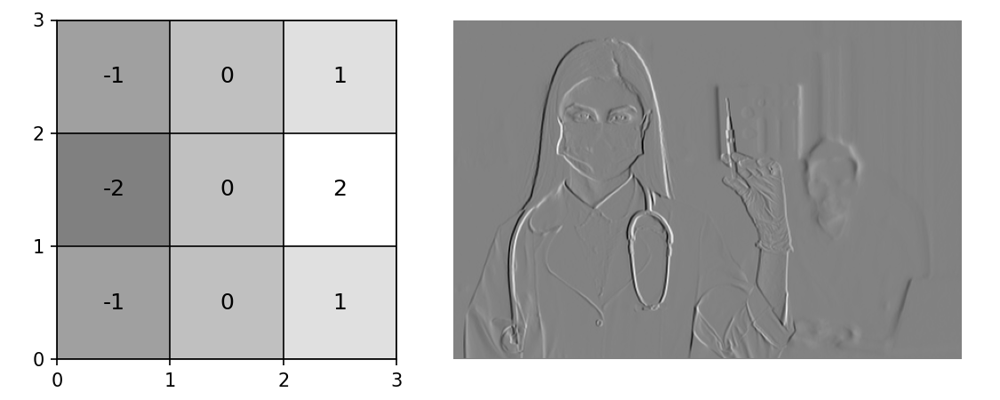
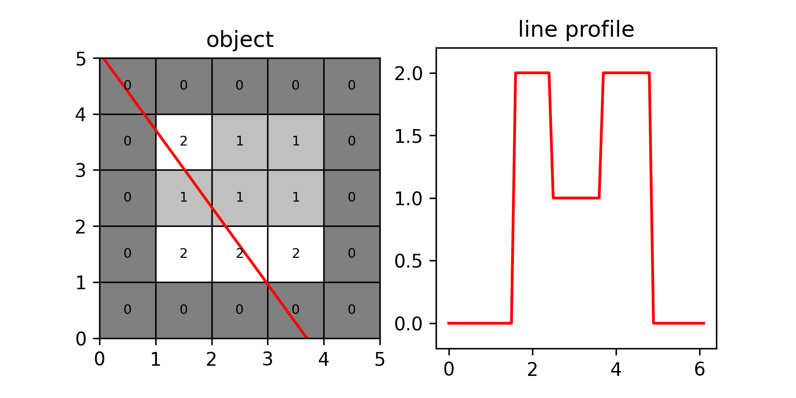
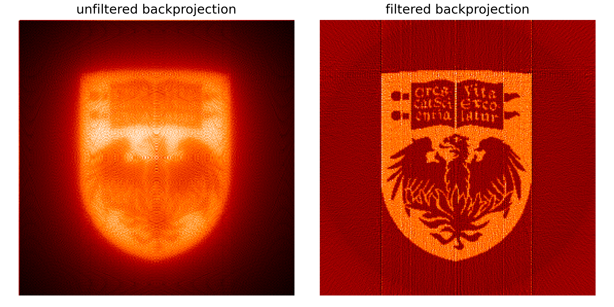
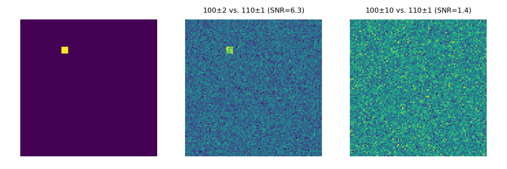

# MPHY349-demos

A collection of interactive Jupyter notebooks to demonstrate concepts for the course MPHY34900 "Mathematics for Medical Physics."

## image-filter-demo

Demo of 2D convolution utility with a few example images and filters. For example uniform kernels create blur (reducing noise), or a Sobel filter detects edges along a given orientation.

## radon-transform-demo

Demo of the 2D Radon Transform, starting with single line integrals then full 2D sinograms with line integral pixel values.

## backprojection-demo

Demo of 2D backprojection, inverting the output sinograms from radon-transform-demo. Compares backprojection result for raw data and filtered data.

## noise-demo

Demonstration of signal vs. background for different signal-to-noise ratios.

